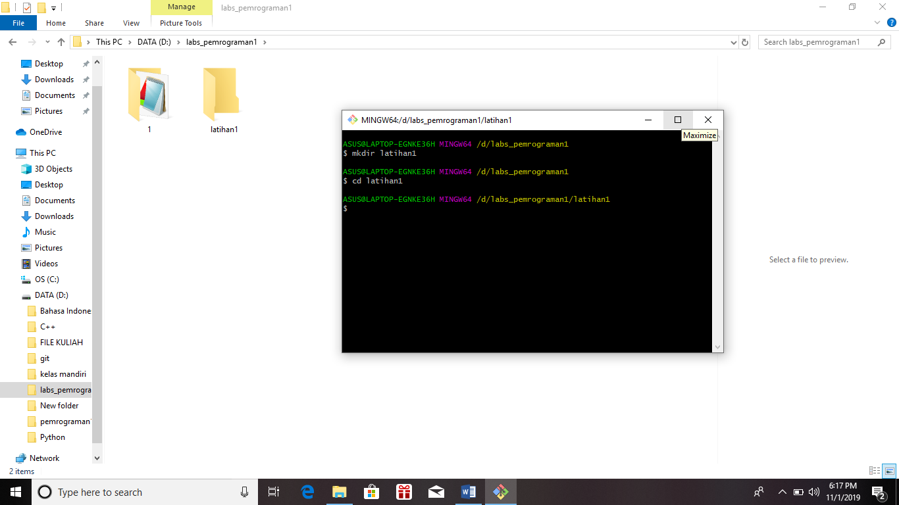
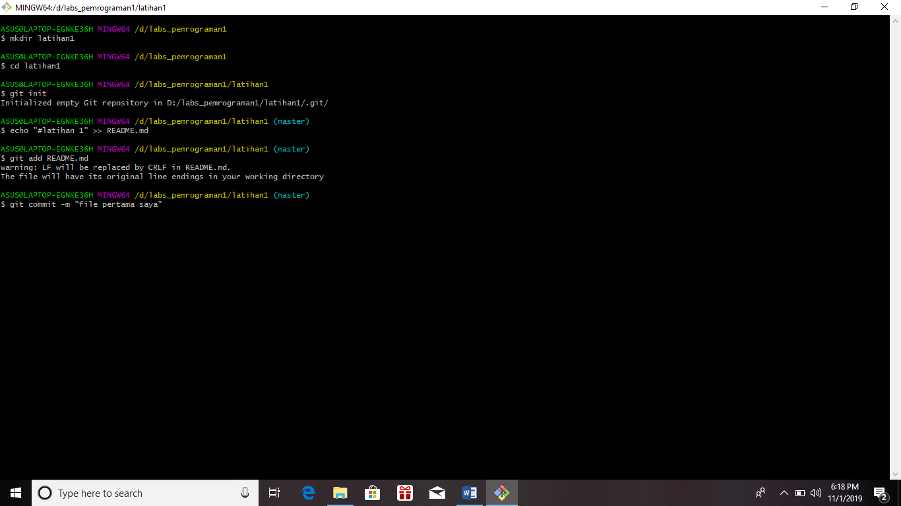
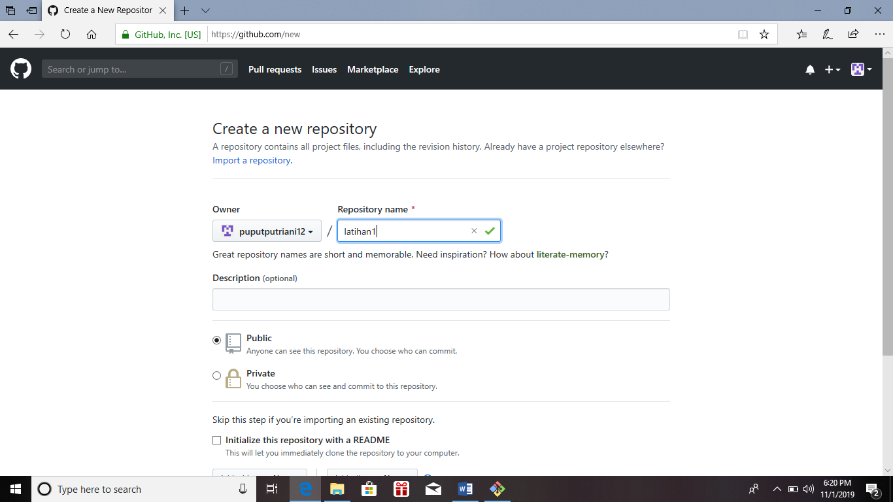
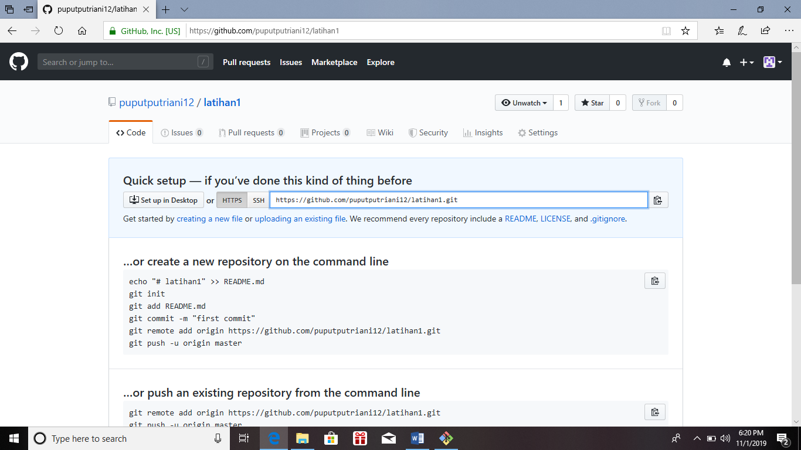
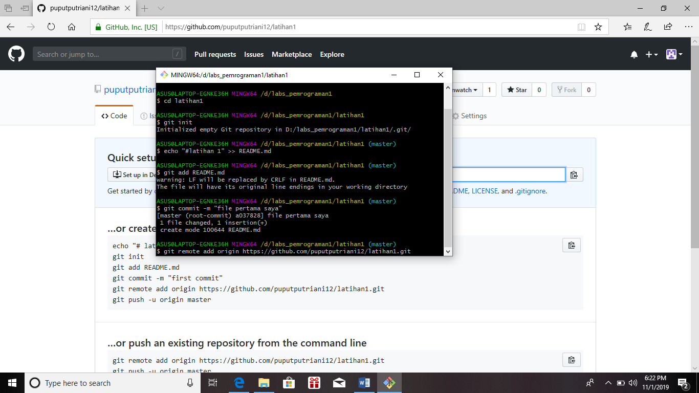
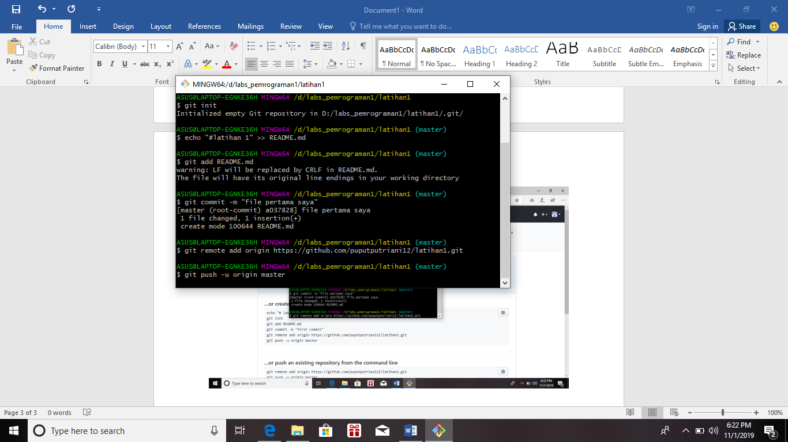
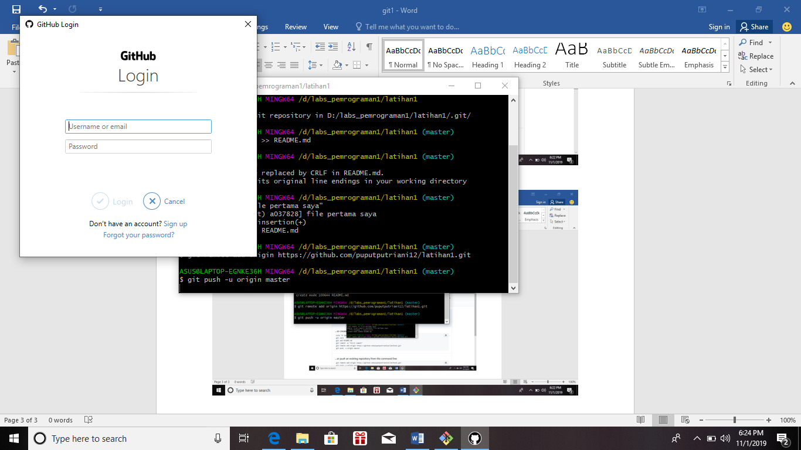
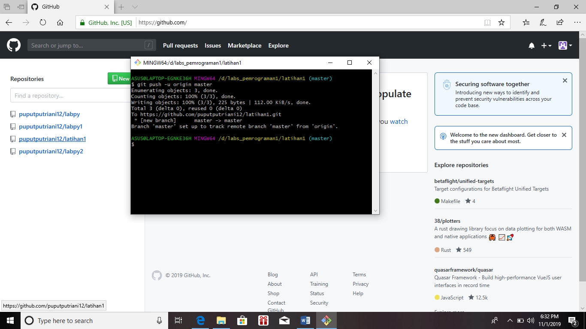
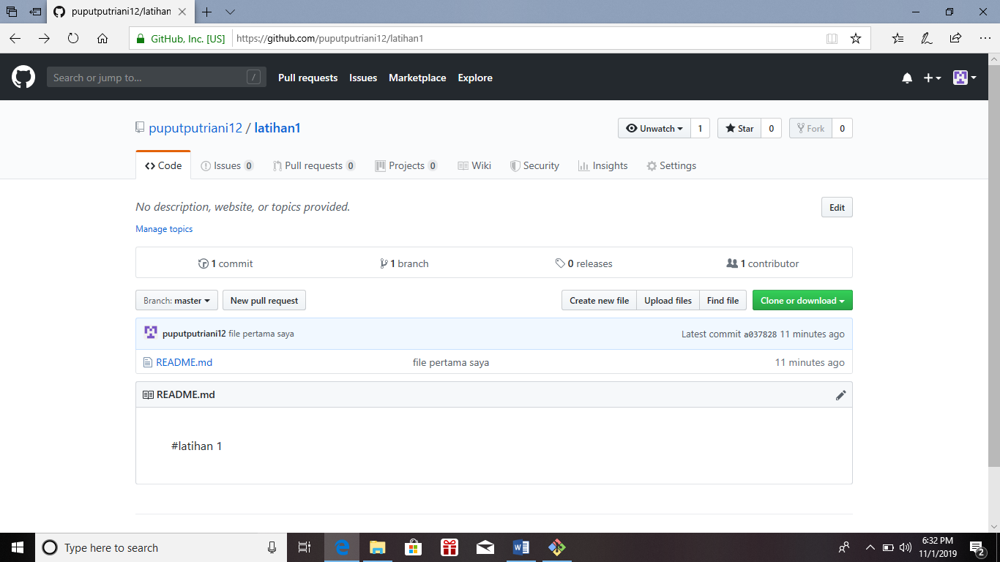
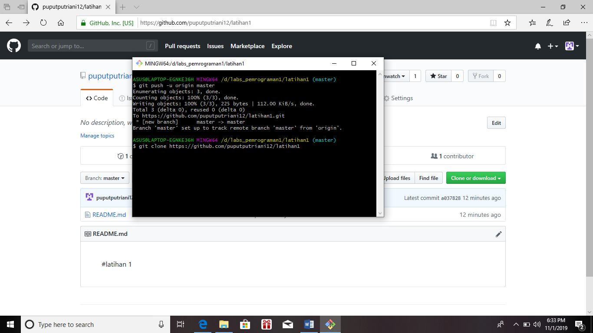

1.Download aplikasi git. lalu buka aplikasi tersebut
*2.Menambahkan Global Config.Pada saat pertama kali menggunakan git, perlu dilakukan konfigurasi user.name dan user.email.
3.Buka direktory aktif, misal: d:\labs_pemrograman1.
4.klik kanan pada direktory aktif tersebut, dan pilih menu Git Bash, sehingga muncul git bash command 
5.Buat direktory project praktikum pertama dengan nama latihan1
6.Sehingga terbentuk satu direktori baru dibawahnya, selanjutnya masuk kedalam direktori tersebut dengan perintah cd (change directory)    direktory aktif menjadi: d:\labs_pemrograman1\latihan1

7.Jalankan perintah git init, untuk membuat repository local.
8.Disini kita akan coba buat satu file bernama README.md (text file)

9.Untuk menambahkan file yang baru saja dibuat tersebut gunakan perintah git add.

10.Untuk menyimpan perubahan yang ada kedalam database repository local, gunakan perintah git commit -m “komentar commit”

11.Server reopsitory yang akan kita gunakan adalah http://github.com 
12.Pada laman github, klik tombol start a project, atau dari menu (icon +) klik New Repository.

13.Isi nama repositorynya, misal: labpy1. lalu klik tombol Create repository.

14.Untuk menambahkan remote repository server, gunakan perintah git remote add origin [url]

15.Untuk mengirim perubahan pada local repository ke server gunakan perintah git push.

16.Buka laman github.com, arahkan pada repositorinya.Maka perubahan akan terlihat pada laman tersebut.

17.Untuk melakukan cloning, gunakan perintah git clone [url]

